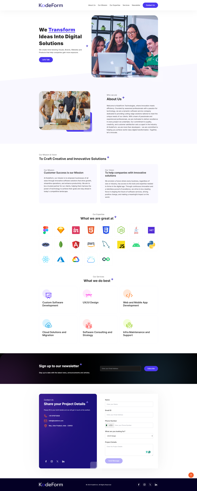

# KodeForm Landing Page

A responsive software company landing page created as a self-learning project by converting a PSD design into a fully functional website. The project focuses on pixel-perfect implementation, responsive layouts, reusable UI components, and interactive form elements using vanilla JavaScript.

## 📸 Preview

## ✨ Features

- Responsive landing page
- Pixel-perfect PSD to HTML conversion
- Modern hero section
- About, Mission & Vision sections
- Technology showcase
- Services section
- Newsletter subscription form
- Contact form with international phone number input
- Cross-browser compatibility

## 🛠 Tech Stack

- HTML5
- CSS3
- Vanilla JavaScript
- intl-tel-input

## 🚀 Live Demo

https://bluedeepart.github.io/startup/

## 📄 License

This project was created for self-learning by converting a publicly available PSD design into a responsive website. All original design rights belong to their respective owner.
